# Загрузка системы

Systemd - создание unit-файла

## Содержание

- [Загрузка системы](#загрузка-системы)
  - [Содержание](#содержание)
  - [Цель](#цель)
  - [Пошаговая инструкция выполнения домашнего задания](#пошаговая-инструкция-выполнения-домашнего-задания)
    - [Что нужно сделать](#что-нужно-сделать)
  - [Базовый образ](#базовый-образ)
  - [Создание сервиса мониторинга лога на предмет наличия ключевого слова](#создание-сервиса-мониторинга-лога-на-предмет-наличия-ключевого-слова)
  - [Установить `spawn-fcgi` и создать unit-файл `spawn-fcgi.service` с помощью переделки init-скрипта](#установить-spawn-fcgi-и-создать-unit-файл-spawn-fcgiservice-с-помощью-переделки-init-скрипта)
  - [Запуск нескольких инстансов сервера Nginx](#запуск-нескольких-инстансов-сервера-nginx)

## Цель

- научиться редактировать существующие и создавать новые unit-файлы

## Пошаговая инструкция выполнения домашнего задания

### Что нужно сделать

1. Написать service, который будет раз в 30 секунд мониторить лог на предмет наличия ключевого слова (файл лога и ключевое слово должны задаваться в `/etc/default`)
2. Установить `spawn-fcgi` и создать unit-файл (`spawn-fcgi.service`) с помощью переделки init-скрипта [https://gist.github.com/cea2k/1318020](https://gist.github.com/cea2k/1318020)
3. Доработать unit-файл `Nginx` (nginx.service) для запуска нескольких инстансов сервера с разными конфигурационными файлами одновременно

## Базовый образ

Для выполнения текущего задания используется базовый образ `Ubuntu 24.04.3 LTS`.

<table>
<tr><td style="border: 1px solid #777; padding: 10px;">

```bash
ubuntu@ubuntu:~$ sudo -i
root@ubuntu:~# uname --all
Linux ubuntu 6.8.0-100-generic #100-Ubuntu SMP PREEMPT_DYNAMIC Tue Jan 13 16:40:06 UTC 2026 x86_64 x86_64 x86_64 GNU/Linux
root@ubuntu:~# cat /etc/os-release
PRETTY_NAME="Ubuntu 24.04.3 LTS"
NAME="Ubuntu"
VERSION_ID="24.04"
VERSION="24.04.3 LTS (Noble Numbat)"
VERSION_CODENAME=noble
ID=ubuntu
ID_LIKE=debian
HOME_URL="https://www.ubuntu.com/"
SUPPORT_URL="https://help.ubuntu.com/"
BUG_REPORT_URL="https://bugs.launchpad.net/ubuntu/"
PRIVACY_POLICY_URL="https://www.ubuntu.com/legal/terms-and-policies/privacy-policy"
UBUNTU_CODENAME=noble
LOGO=ubuntu-logo
```

<details>
<summary>📸 Скриншот кода...</summary>
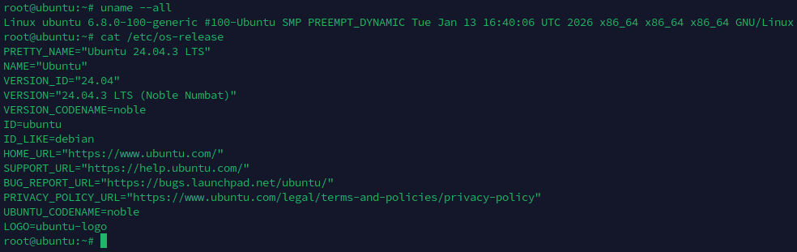
</details>

</td></tr>
</table>

## Создание сервиса мониторинга лога на предмет наличия ключевого слова

Задачу можно разделить на логические части:

- создание файла, где будем искать ключевое слово `/var/log/watchlog.log`
- создание bash-скрипта для проверки файла на ключевое слово `/opt/watchlog.sh`
- создание файла конфигурации для сервиса `/etc/default/watchlog.conf`, где определим параметры запуска
- создание unit-файла для запуска скрипта `/etc/systemd/system/watchlog.service`
- создание unit-файла таймера `/etc/systemd/system/watchlog.timer` для запуска сервиса `watchlog.service`

Для себя имеем ввиду, что работаем из-под пользователя `root`, иначе нужно для файлов выставить права доступа.

Ниже приведу код каждого из файлов:

<table>
<tr><td style="border: 1px solid #777; padding: 10px;">

<details>
<summary>/var/log/watchlog.log</summary>

```text
# Text file for test watchlog-service
08.02.2026 10:00: Initial exec...
08.02.2026 10:01: ALERT: Some alert text
08.02.2026 10:02: Message...
```

</details>

<details>
<summary>/opt/watchlog.sh</summary>

```bash
#!/usr/bin/env bash

set -euo pipefail

function dt_log {
  local __MSG="$(date +'%d.%m.%Y %H:%M:%S %Z(UTC%z)'): $1"
  echo "${__MSG}"
  ## Add message also to `/var/log/syslog`
  logger "${__MSG}"
}

# -------------------------------------------------
WORD=$1
LOG=$2

if grep -i "${WORD}" "${LOG}" &> /dev/null; then
  dt_log "I found word ${WORD} in file ${LOG}!"
else
  exit 0
fi
```

</details>

<details>
<summary>/etc/default/watchlog.conf</summary>

```ini
# Configuration file `watchlog.conf` for watchlog-service
# Place it to /etc/default

# File and word in that file that we will be monit
WORD="ALERT"
LOG="/var/log/watchlog.log"
```

</details>

<details>
<summary>/etc/systemd/system/watchlog.service</summary>

```ini
[Unit]
Description=My watchlog service

[Service]
Type=oneshot
EnvironmentFile=/etc/default/watchlog.conf
ExecStart=/opt/watchlog.sh "${WORD}" "${LOG}"
RemainAfterExit=no
```

</details>

<details>
<summary>/etc/systemd/system/watchlog.timer</summary>

```ini
[Unit]
Description=Run watchlog script every 30 second

[Timer]
# Run every 30 second
OnActiveSec=30
OnUnitActiveSec=30
Unit=watchlog.service
Persistent=true

[Install]
WantedBy=timers.target
```

</details>

</td></tr>
</table>

Запуск сервиса и проверка его работы

<table>
<tr><td style="border: 1px solid #777; padding: 10px;">

```bash
sudo systemctl daemon-reload
sudo systemctl start watchlog.timer
sudo systemctl status watchlog.timer
sudo journalctl -u watchlog.service | tail -n 20
```

<details>
<summary>📸 Скриншот кода...</summary>
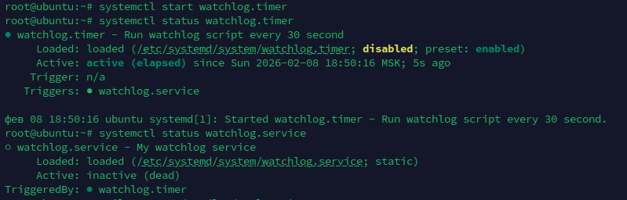
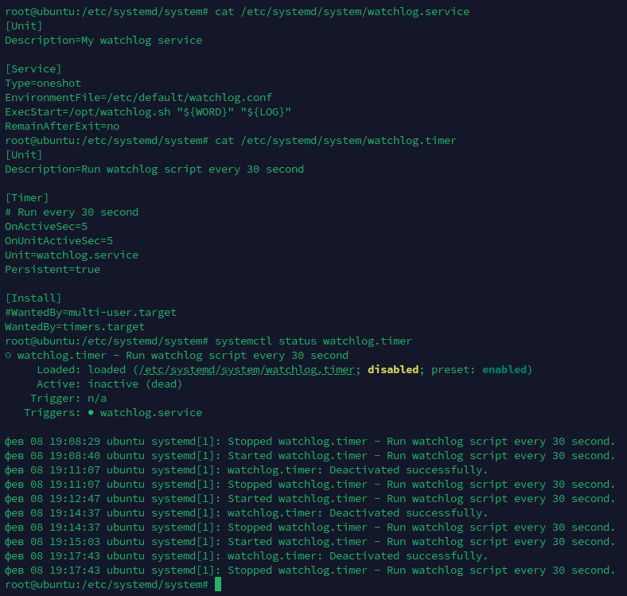
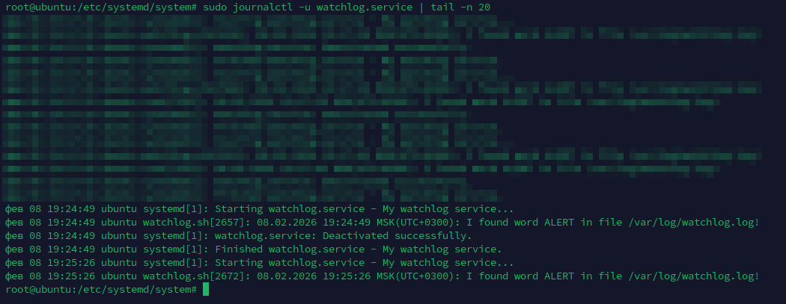
</details>

</td></tr>
</table>

## Установить `spawn-fcgi` и создать unit-файл `spawn-fcgi.service` с помощью переделки init-скрипта

Устанавливаем `spawn-fcgi` и необходимые для него пакеты

```bash
sudo apt-get update && sudo apt-get install -y spawn-fcgi php php-cgi php-cli apache2 libapache2-mod-fcgid fcgiwrap
```

Создаем файл с настройками для будущего сервиса в файле `/etc/spawn-fcgi/fcgi.conf`

<table>
<tr><td style="border: 1px solid #777; padding: 10px;">

```bash
sudo mkdir -p /etc/spawn-fcgi

sudo tee > /etc/spawn-fcgi/fcgi.conf <<EOF
SOCKET=/var/run/php-fcgi.sock
PIDFile=/run/spawn-fcgi.pid
OPTIONS="-u www-data -g www-data -s  -S -M 0600 -C 32 -F 1 -- /usr/bin/php-cgi"
EOF

sudo tee > /etc/systemd/system/spawn-fcgi.service <<EOF
[Unit]
Description=Spawn-fcgi startup service by Otus
After=network.target

[Service]
Type=simple
PIDFile=$PIDFile
EnvironmentFile=/etc/spawn-fcgi/fcgi.conf

ExecStart=/usr/bin/spawn-fcgi -n $OPTIONS
ExecStop=/bin/kill -TERM $MAINPID
ExecStopPost=/bin/rm -f $PIDFile

# Kill child processes
KillMode=control-group
TimeoutStopSec=10

Restart=on-failure
RestartSec=3s

[Install]
WantedBy=multi-user.target
EOF
```

<details>
<summary>📸 Скриншот кода...</summary>
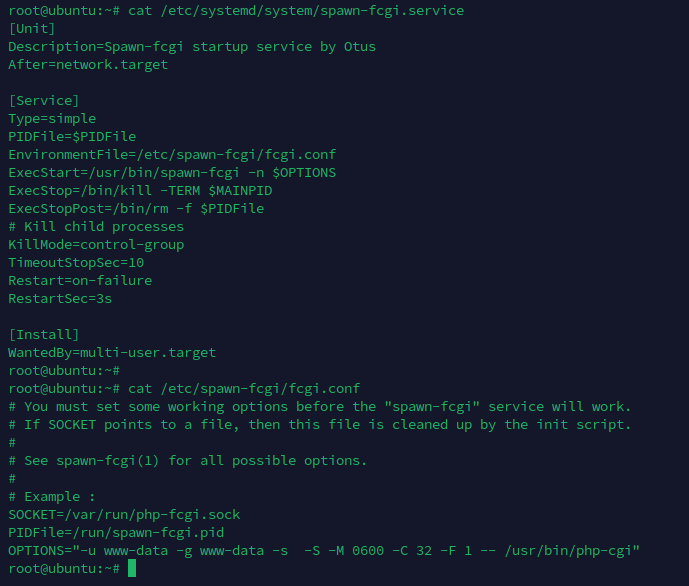
</details>

</td></tr>
</table>

Перегружаем сервисы и проверяем работу

<table>
<tr><td style="border: 1px solid #777; padding: 10px;">

```bash
sudo systemctl daemon-reload
sudo systemctl start spawn-fcgi
sudo systemctl status spawn-fcgi

sudo systemctl stop spawn-fcgi
sudo systemctl status spawn-fcgi

sudo systemctl start spawn-fcgi
sudo systemctl restart spawn-fcgi
sudo systemctl status spawn-fcgi
```

<details>
<summary>📸 Скриншоты кода...</summary>
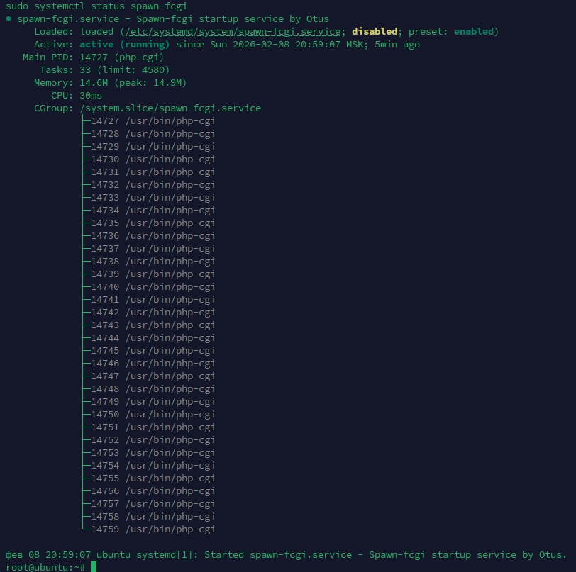
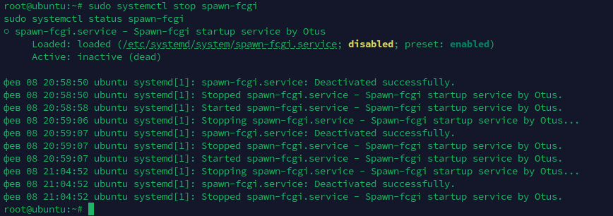
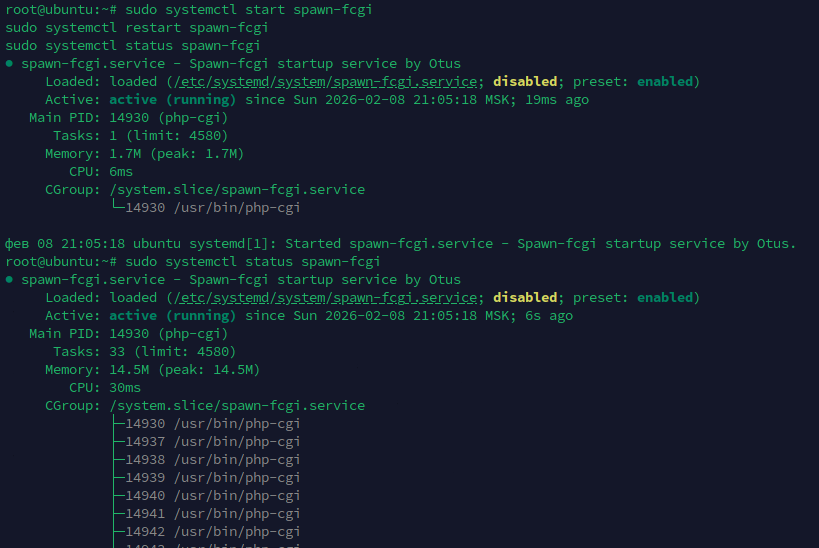
</details>

</td></tr>
</table>

## Запуск нескольких инстансов сервера Nginx

Установим Nginx из стандартного репозитория:

```bash
sudo apt-get update && sudo apt-get install -y nginx
```

Скопируем оригинальный unit-файл в файл `nginx.service.orig` для бэкапа:

```bash
mv /usr/lib/systemd/system/nginx.service{,.orig}
```

После чего создадим переопределение настроек для каждого из сервисов:

<table>
<tr><td style="border: 1px solid #777; padding: 10px;">

```bash
sudo tee > /usr/lib/systemd/system/nginx-first.service <<EOF
[Unit]
Description=A high performance web server and a reverse proxy server
Documentation=man:nginx(8)
After=network-online.target remote-fs.target nss-lookup.target
Wants=network-online.target
ConditionFileIsExecutable=/usr/sbin/nginx

[Service]
Type=forking
PIDFile=/run/nginx-first.pid
ExecStartPre=/usr/sbin/nginx -t -c /etc/nginx/nginx-first.conf -q -g 'daemon on; master_process on;'
ExecStart=/usr/sbin/nginx -c /etc/nginx/nginx-first.conf -g 'daemon on; master_process on;'
ExecReload=/usr/sbin/nginx -c /etc/nginx/nginx-first.conf -g 'daemon on; master_process on;' -s reload
ExecStop=-/sbin/start-stop-daemon --quiet --stop --retry QUIT/5 --pidfile /run/nginx-first.pid
TimeoutStopSec=5
KillMode=mixed

[Install]
WantedBy=multi-user.target
EOF

sudo tee > /usr/lib/systemd/system/nginx-second.service <<EOF
[Unit]
Description=A high performance web server and a reverse proxy server
Documentation=man:nginx(8)
After=network-online.target remote-fs.target nss-lookup.target
Wants=network-online.target
ConditionFileIsExecutable=/usr/sbin/nginx

[Service]
Type=forking
PIDFile=/run/nginx-second.pid
ExecStartPre=/usr/sbin/nginx -t -c /etc/nginx/nginx-second.conf -q -g 'daemon on; master_process on;'
ExecStart=/usr/sbin/nginx -c /etc/nginx/nginx-second.conf -g 'daemon on; master_process on;'
ExecReload=/usr/sbin/nginx -c /etc/nginx/nginx-second.conf -g 'daemon on; master_process on;' -s reload
ExecStop=-/sbin/start-stop-daemon --quiet --stop --retry QUIT/5 --pidfile /run/nginx-second.pid
TimeoutStopSec=5
KillMode=mixed

[Install]
WantedBy=multi-user.target
EOF
```

<details>
<summary>📸 Скриншоты кода...</summary>

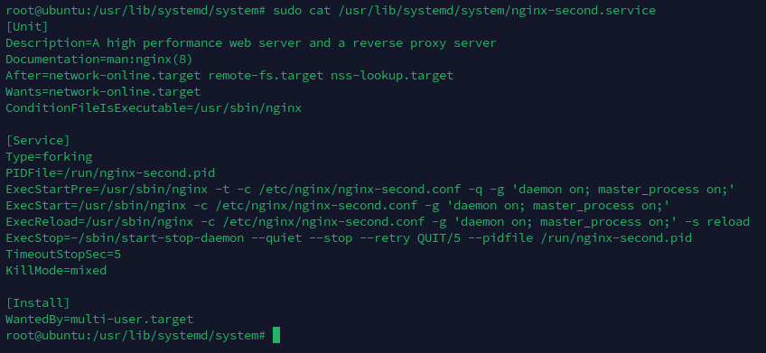
</details>

</td></tr>
</table>

Подготавливаем файлы настроек для каждого сервиса из оригинального файла настроек.
Оригинальный файл бэкапим.

```bash
sudo cp /etc/nginx/nginx.conf /etc/nginx/nginx-first.conf
sudo cp /etc/nginx/nginx.conf /etc/nginx/nginx-second.conf
sudo mv /etc/nginx/nginx.conf{,.orig}
```

> Вообще данный подход плохой, так как нужно следить, чтобы не было пересечения по портам.
> Лучше для такого использовать контейнеризацию на основе docker, podman, kubernetes и т.д.

Изменим настройки для каждого из сервисов:

<table>
<tr><td style="border: 1px solid #777; padding: 10px;">

```bash
sudo mkdir -p /etc/nginx/sites-available-first/
sudo mkdir -p /etc/nginx/sites-enabled-first/

sudo mkdir -p /etc/nginx/sites-available-second/
sudo mkdir -p /etc/nginx/sites-enabled-second/

sudo mkdir -p /etc/nginx/conf-first.d/
sudo mkdir -p /etc/nginx/conf-second.d/

# change configs
sed -e 's/pid \/run\/nginx.pid;/pid \/run\/nginx-first.pid;/g' -i /etc/nginx/nginx-first.conf
sed -e 's/pid \/run\/nginx.pid;/pid \/run\/nginx-second.pid;/g' -i /etc/nginx/nginx-second.conf

sed -e 's/include \/etc\/nginx\/conf.d\/\*.conf;/include \/etc\/nginx\/conf-first.d\/\*.conf;/g' -i /etc/nginx/nginx-first.conf 
sed -e 's/include \/etc\/nginx\/conf.d\/\*.conf;/include \/etc\/nginx\/conf-second.d\/\*.conf;/g' -i /etc/nginx/nginx-second.conf 

sed -e 's/include \/etc\/nginx\/sites-enabled\/\*;/include \/etc\/nginx\/sites-enabled-first\/\*;/g' -i /etc/nginx/nginx-first.conf 
sed -e 's/include \/etc\/nginx\/sites-enabled\/\*;/include \/etc\/nginx\/sites-enabled-second\/\*;/g' -i /etc/nginx/nginx-second.conf 
```

<details>
<summary>📸 Скриншот кода...</summary>
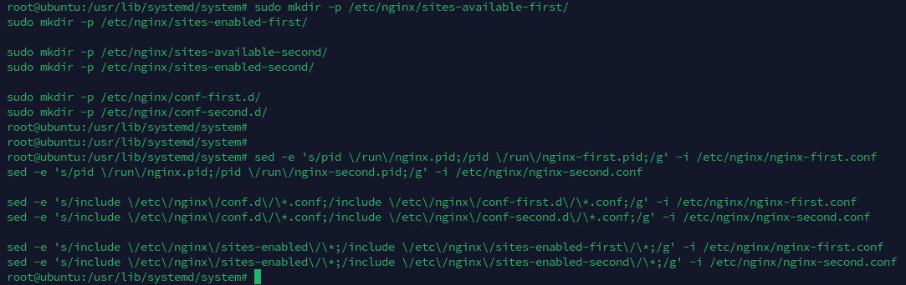
</details>

</td></tr>
</table>

Подготаливаем конфигурации для каждого из сервисов.

```bash
sudo tee > /etc/nginx/conf-first.d/site01.conf <<EOF
server {
  listen 9000 default_server;
  listen [::]:9000 default_server;

  root /var/www/html;
  index index.html index.htm index.nginx-debian.html;

  server_name _;

  location / {
    try_files $uri $uri/ =404;
  }
EOF

sudo tee > /etc/nginx/conf-second.d/site01.conf <<EOF
server {
  listen 9001 default_server;
  listen [::]:9001 default_server;

  root /var/www/html;
  index index.html index.htm index.nginx-debian.html;

  server_name _;

  location / {
    try_files $uri $uri/ =404;
  }
EOF
```

<details>
<summary>📸 Скриншот кода...</summary>
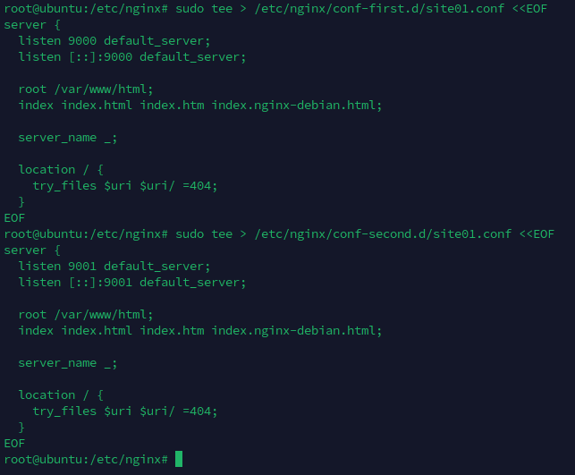
</details>

</td></tr>
</table>

Стартуем оба сервиса:

<table>
<tr><td style="border: 1px solid #777; padding: 10px;">

```bash
sudo systemctl daemon-reload
sudo systemctl start nginx-first.service
sudo systemctl start nginx-second.service
sudo ss -tlpn | grep nginx
```

<details>
<summary>📸 Скриншоты кода...</summary>
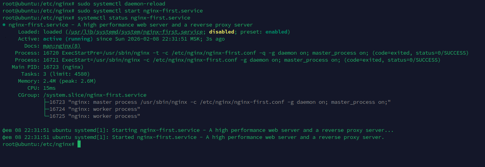
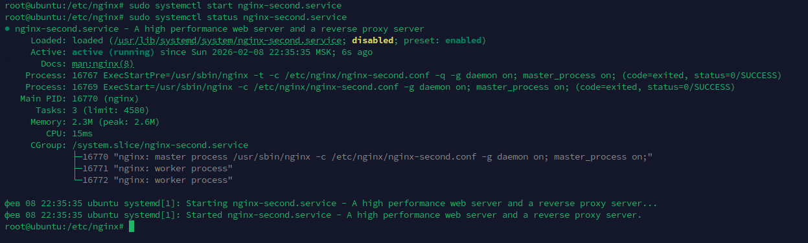
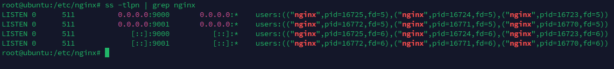
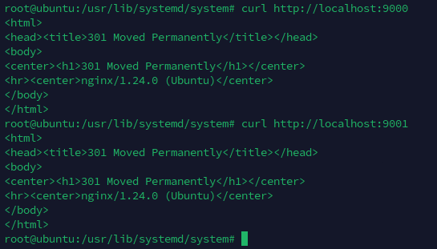
</details>

</td></tr>
</table>
